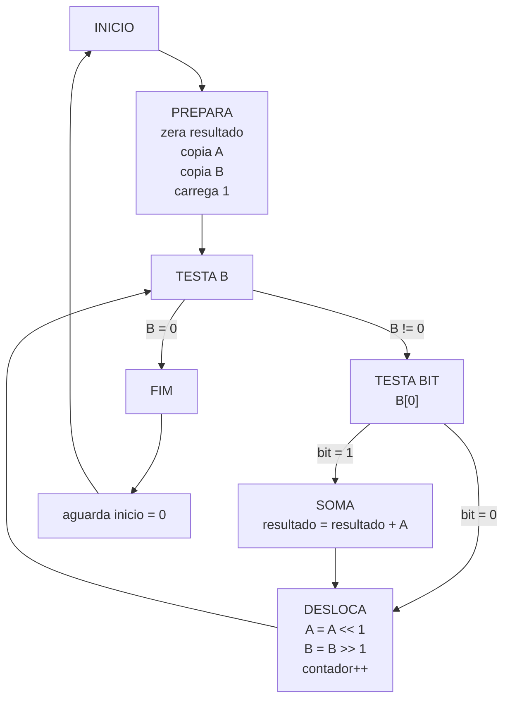

# Atividade 1 - Multiplicacao por Somas e Deslocamentos

## Diagrama de estados



No codigo Verilog, os estados `SOMA` e `DESLOCA` foram divididos em estados de preparacao e escrita para respeitar o funcionamento do datapath fornecido.

## Tabela de transicao de estados

| Estado atual | Condicao | Proximo estado |
|---|---|---|
| IDLE | `inicio = 0` | IDLE |
| IDLE | `inicio = 1` | INIT_RES |
| INIT_RES | sempre | INIT_UM |
| INIT_UM | sempre | COPIA_A |
| COPIA_A | sempre | COPIA_B |
| COPIA_B | sempre | TESTA |
| TESTA | `R4 = 0` | FIM |
| TESTA | `R4 != 0`, `(R4 AND 1) = 0`, `contador < 9` | PREP_DESL_A |
| TESTA | `R4 != 0`, `(R4 AND 1) = 0`, `contador = 9` | FIM |
| TESTA | `R4 != 0`, `(R4 AND 1) != 0` | PREP_SOMA |
| PREP_SOMA | sempre | SOMA |
| SOMA | `contador = 9` | FIM |
| SOMA | nao ha mais bits em `R4` | FIM |
| SOMA | ainda ha bits em `R4` | PREP_DESL_A |
| PREP_DESL_A | sempre | DESL_A |
| DESL_A | sempre | DESL_B |
| DESL_B | sempre | INC |
| INC | sempre | TESTA |
| FIM | `inicio = 1` | FIM |
| FIM | `inicio = 0` | IDLE |

## Tabela de saidas dos sinais de controle do datapath

Registradores:

```text
R0 = A
R1 = B
R2 = acumulador / resultado
R3 = multiplicando deslocado
R4 = multiplicador deslocado
R5 = constante 1
```

| Estado | write_enable | sel_ra | sel_rb | sel_rw | sel_op | mux_w_sel | ext_w |
|---|---:|---|---|---|---|---:|---|
| IDLE, carregando A | 1 | X | X | R0 | X | 1 | valor externo |
| IDLE, carregando B | 1 | X | X | R1 | X | 1 | valor externo |
| INIT_RES | 1 | X | X | R2 | X | 1 | 0 |
| INIT_UM | 1 | X | X | R5 | X | 1 | 1 |
| COPIA_A | 1 | R0 | R2 | R3 | ADD | 0 | X |
| COPIA_B | 1 | R1 | R2 | R4 | ADD | 0 | X |
| TESTA | 0 | R4 | R5 | X | AND | 0 | X |
| PREP_SOMA | 0 | R2 | R3 | R2 | ADD | 0 | X |
| SOMA | 1 | R2 | R3 | R2 | ADD | 0 | X |
| PREP_DESL_A | 0 | R3 | R5 | R3 | SLL | 0 | X |
| DESL_A | 1 | R3 | R5 | R3 | SLL | 0 | X |
| DESL_B | 1 | R4 | R5 | R4 | SRL | 0 | X |
| INC | 0 | X | X | X | X | X | X |
| FIM | 0 | R2 | X | X | X | 0 | X |

Operacoes usadas da ULA:

```text
ADD = 011
AND = 100
SLL = 001
SRL = 010
```

## Demonstracao funcional na placa DE1

Controles:

| Sinal | Funcao |
|---|---|
| `SW[9:0]` | Valor a carregar |
| `KEY0` | Clock manual com debounce |
| `KEY1` | Carrega A |
| `KEY2` | Carrega B |
| `KEY3` | Inicio |
| `LEDG0` | Concluido |
| `LEDG1` | Overflow ao concluir |
| `HEX3..HEX0` | Resultado decimal |

Testes:

| Teste | Resultado esperado | LEDs esperados |
|---|---|---|
| `3 * 5` | `0015` | `LEDG0=1`, `LEDG1=0` |
| `0 * 789` | `0000` | `LEDG0=1`, `LEDG1=0` |
| `31 * 33` | `1023` | `LEDG0=1`, `LEDG1=0` |
| `32 * 32` | `0000` truncado | `LEDG0=1`, `LEDG1=1` |
| `600 * 1` | `0600` | `LEDG0=1`, `LEDG1=0` |

Entre testes, solte `KEY3` e aperte `KEY0` uma vez para voltar ao estado inicial.

## Questoes de analise

### 1. Quantos ciclos de clock sao necessarios?

Contando os pulsos de `KEY0`, incluindo o pulso que tira a FSM de `IDLE`:

| Caso | Ciclos |
|---|---:|
| Melhor caso, `B = 0` | 6 |
| Melhor caso com `B != 0`, exemplo `B = 1` | 8 |
| Pior caso, `B = 1023` | 71 |

A diferenca depende da posicao do bit `1` mais significativo de `B` e da quantidade de bits `1`, pois cada bit `1` exige soma.

### 2. Qual e o maior produto representavel com 10 bits?

O maior valor sem sinal em 10 bits e:

```text
1023
```

Qualquer par em que `A * B > 1023` causa overflow. Exemplos:

```text
32 * 32 = 1024
512 * 2 = 1024
1023 * 2 = 2046
```

A FSM marca overflow quando uma soma gera carry ou quando um termo deslocado maior que 10 bits ainda precisa ser usado em uma soma. O LED `LEDG1` acende no final se houve overflow.

### 3. Como o algoritmo se comporta quando um operando e zero?

Se `B = 0`, a FSM termina em `TESTA`, pois o multiplicador deslocado `R4` ja e zero. O acumulador `R2` permanece zero.

Se `A = 0`, as somas adicionam zero ao acumulador. O resultado tambem fica zero.

Portanto, a FSM trata corretamente os casos com zero.
