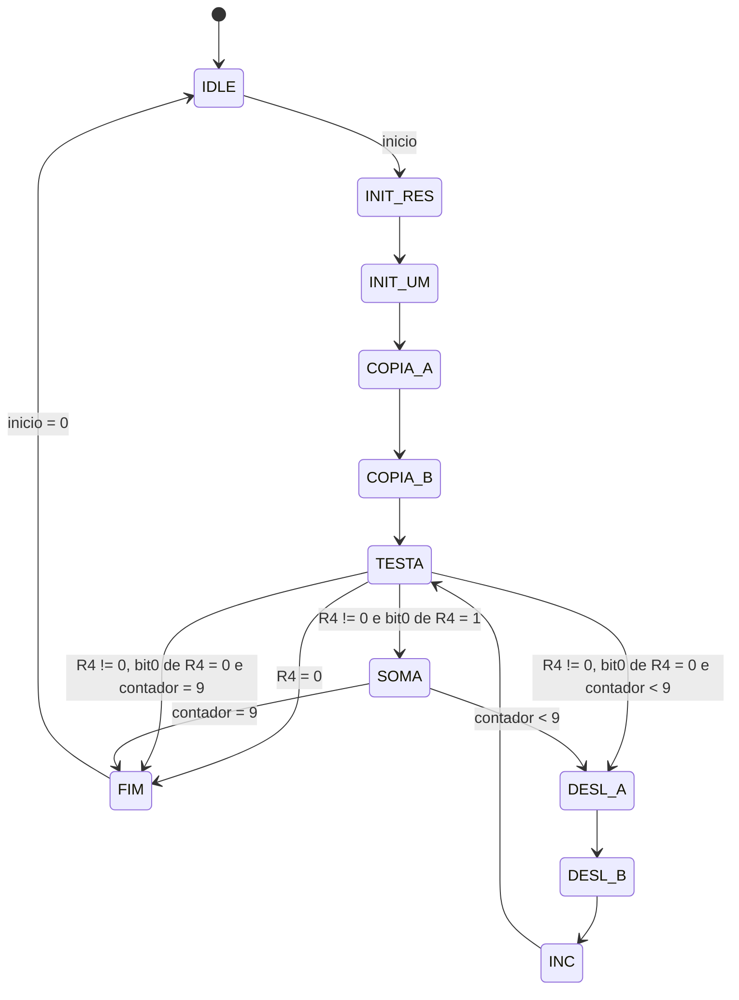

# Atividade 1 - Multiplicacao por Somas e Deslocamentos

## Ideia usada

Os operandos sao carregados antes do inicio:

- `R0`: operando A
- `R1`: operando B

Quando `inicio` e acionado, a FSM prepara os registradores de trabalho:

- `R2`: acumulador, iniciado com zero
- `R3`: copia de A, que vai sendo deslocada para a esquerda
- `R4`: copia de B, que vai sendo deslocada para a direita
- `R5`: constante 1

Em cada repeticao, a FSM testa o bit menos significativo de `R4` usando `R4 AND 1`. Se esse bit for 1, soma `R3` no acumulador `R2`. Depois desloca `R3` para a esquerda e `R4` para a direita. A FSM para quando `R4` vira zero ou quando os 10 bits ja foram testados.

## Diagrama de estados



## Tabela de transicao de estados

| Estado atual | Condicao | Proximo estado |
|---|---|---|
| IDLE | `inicio = 0` | IDLE |
| IDLE | `inicio = 1` | INIT_RES |
| INIT_RES | sempre | INIT_UM |
| INIT_UM | sempre | COPIA_A |
| COPIA_A | sempre | COPIA_B |
| COPIA_B | sempre | TESTA |
| TESTA | `R4 = 0` | FIM |
| TESTA | `R4 != 0`, `s = 0` e `contador < 9` | DESL_A |
| TESTA | `R4 != 0`, `s = 0` e `contador = 9` | FIM |
| TESTA | `R4 != 0` e `s != 0` | SOMA |
| SOMA | `contador < 9` | DESL_A |
| SOMA | `contador = 9` | FIM |
| DESL_A | sempre | DESL_B |
| DESL_B | sempre | INC |
| INC | sempre | TESTA |
| FIM | `inicio = 1` | FIM |
| FIM | `inicio = 0` | IDLE |

## Tabela de saidas de controle do datapath

| Estado | write_enable | sel_ra | sel_rb | sel_rw | sel_op | mux_w_sel | ext_w |
|---|---:|---|---|---|---|---:|---|
| IDLE, carregando A | 1 | X | X | R0 | X | 1 | valor externo |
| IDLE, carregando B | 1 | X | X | R1 | X | 1 | valor externo |
| INIT_RES | 1 | X | X | R2 | X | 1 | 0 |
| INIT_UM | 1 | X | X | R5 | X | 1 | 1 |
| COPIA_A | 1 | R0 | R2 | R3 | ADD | 0 | X |
| COPIA_B | 1 | R1 | R2 | R4 | ADD | 0 | X |
| TESTA | 0 | R4 | R5 | X | AND | 0 | X |
| SOMA | 1 | R2 | R3 | R2 | ADD | 0 | X |
| DESL_A | 1 | R3 | R5 | R3 | SLL | 0 | X |
| DESL_B | 1 | R4 | R5 | R4 | SRL | 0 | X |
| INC | 0 | X | X | X | X | X | X |
| FIM | 0 | R2 | X | X | X | 0 | X |

## Questoes de analise

1. No pior caso, quando o bit mais significativo do multiplicador precisa ser testado e ha muitos bits 1, sao necessarios 51 ciclos efetivos depois que o inicio ja foi aceito: 4 ciclos de preparacao, 9 repeticoes completas com teste, soma, dois deslocamentos e incremento, e a ultima repeticao com teste e soma. No melhor caso, quando o multiplicador e zero, a FSM termina em 5 ciclos efetivos: 4 de preparacao e 1 teste. Se for contado tambem o clock que tira a FSM do IDLE, some 1 ciclo. A diferenca e determinada pela posicao do bit 1 mais alto do multiplicador e pela quantidade de bits 1 que exigem soma.

2. O maior produto representavel em 10 bits e 1023. Qualquer par em que `A * B > 1023` causa overflow. Exemplos: `32 * 32`, `512 * 2` e `1023 * 2`. A FSM indica overflow quando uma soma estoura 10 bits ou quando um termo deslocado que ja perdeu bits precisa ser somado depois.

3. Se um dos operandos for zero, o resultado final e zero. Se A for zero, todas as somas adicionam zero. Se B for zero, nenhum bit testado e 1, entao nenhuma soma e feita. A FSM trata esse caso corretamente porque o acumulador comeca em zero.

## Como testar em simulador

Com Icarus Verilog instalado, o teste pode ser executado com:

```sh
iverilog -o tb_atividade1.out ../register_file.v ../ula.v ../datapath.v multiplicador_somas_deslocamentos.v tb_atividade1.v
vvp tb_atividade1.out
```
