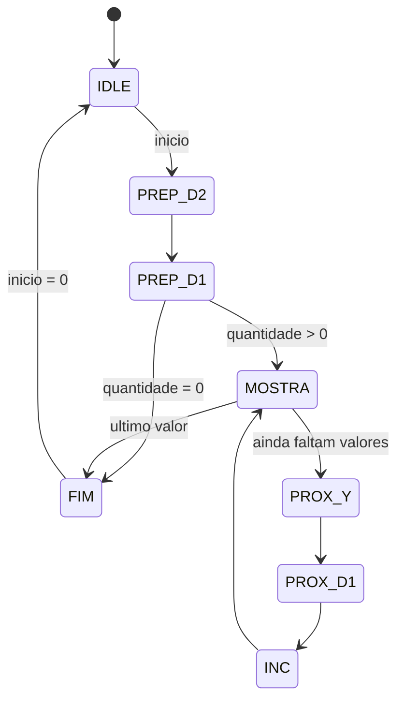

# Atividade 2 - Metodo das Diferencas Finitas

## Ideia usada

Para o polinomio:

```text
p(n) = a*n^2 + b*n + c
```

os valores iniciais sao:

```text
y  = p(0) = c
d1 = p(1) - p(0) = a + b
d2 = segunda diferenca = 2*a
```

Depois disso, cada novo valor e calculado apenas com somas:

```text
y  = y + d1
d1 = d1 + d2
```

## Uso dos registradores

| Registrador | Funcao |
|---|---|
| R0 | coeficiente `a` |
| R1 | coeficiente `b` |
| R2 | valor atual `y` |
| R3 | primeira diferenca `d1` |
| R4 | segunda diferenca `d2` |

O coeficiente `c` e carregado direto em `R2`, porque `p(0)=c`.

## Diagrama de estados



## Tabela de transicao

| Estado atual | Condicao | Proximo estado |
|---|---|---|
| IDLE | `inicio = 0` | IDLE |
| IDLE | `inicio = 1` | PREP_D2 |
| PREP_D2 | sempre | PREP_D1 |
| PREP_D1 | `quantidade = 0` | FIM |
| PREP_D1 | `quantidade > 0` | MOSTRA |
| MOSTRA | `contador + 1 >= quantidade` | FIM |
| MOSTRA | `contador + 1 < quantidade` | PROX_Y |
| PROX_Y | sempre | PROX_D1 |
| PROX_D1 | sempre | INC |
| INC | sempre | MOSTRA |
| FIM | `inicio = 1` | FIM |
| FIM | `inicio = 0` | IDLE |

## Tabela de saidas de controle do datapath

| Estado | write_enable | sel_ra | sel_rb | sel_rw | sel_op | mux_w_sel | ext_w |
|---|---:|---|---|---|---|---:|---|
| IDLE, carregando A | 1 | X | X | R0 | X | 1 | valor externo |
| IDLE, carregando B | 1 | X | X | R1 | X | 1 | valor externo |
| IDLE, carregando C | 1 | X | X | R2 | X | 1 | valor externo |
| PREP_D2 | 1 | R0 | R0 | R4 | ADD | 0 | X |
| PREP_D1 | 1 | R0 | R1 | R3 | ADD | 0 | X |
| MOSTRA | 0 | R2 | X | X | X | 0 | X |
| PROX_Y | 1 | R2 | R3 | R2 | ADD | 0 | X |
| PROX_D1 | 1 | R3 | R4 | R3 | ADD | 0 | X |
| INC | 0 | X | X | X | X | X | X |
| FIM | 0 | R2 | X | X | X | 0 | X |

## Exemplo

Para:

```text
p(n) = 2n^2 + 3n + 1
```

temos:

```text
a = 2
b = 3
c = 1

y  = c     = 1
d1 = a + b = 5
d2 = 2a    = 4
```

Valores gerados:

| n | y mostrado | proximo d1 |
|---:|---:|---:|
| 0 | 1 | 5 |
| 1 | 6 | 9 |
| 2 | 15 | 13 |
| 3 | 28 | 17 |
| 4 | 45 | 21 |

## Questoes de analise

1. Os valores iniciais sao derivados assim: `y=c`, `d1=a+b` e `d2=2a`. Exemplo: para `2n^2 + 3n + 1`, temos `y=1`, `d1=5` e `d2=4`.

2. Depois da preparacao, cada novo valor precisa de duas somas: uma para atualizar `y` e outra para atualizar `d1`. Na avaliacao direta de `a*n^2+b*n+c`, seriam necessarias multiplicacoes e mais somas. A vantagem do metodo e substituir multiplicacoes por somas acumuladas.

3. O metodo nao introduz erro matematico acumulado por aproximacao, porque tudo e inteiro. O que pode acontecer e overflow de 10 bits. Quando uma soma passa de 1023, o valor fica truncado e o LED de overflow e aceso.

## Como testar em simulador

Com Icarus Verilog instalado:

```sh
iverilog -o tb_atividade2.out ../register_file.v ../ula.v ../datapath.v diferencas_finitas_grau2.v tb_atividade2.v
vvp tb_atividade2.out
```

